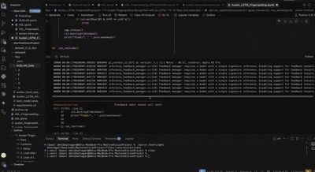
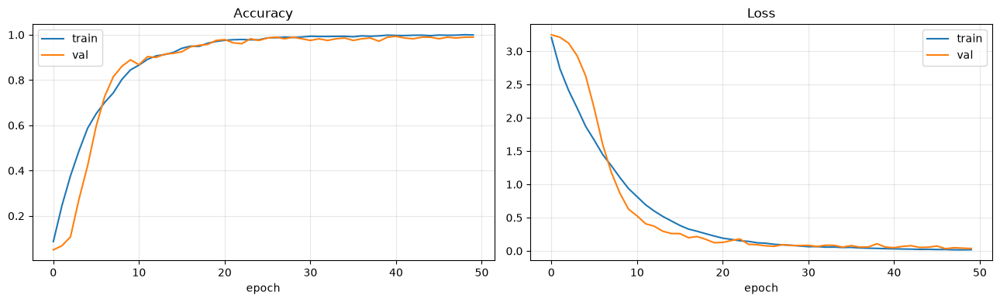
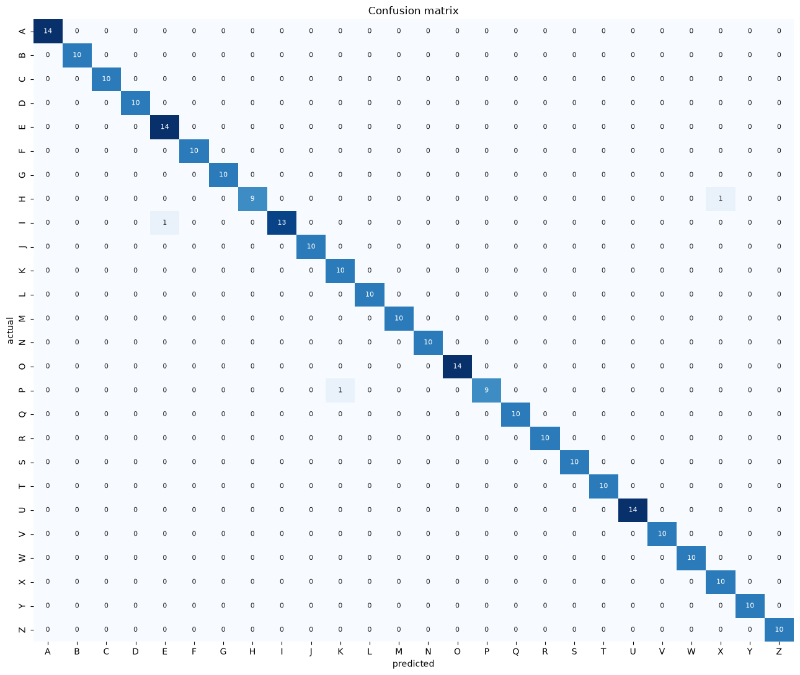

# AUSLAN Fingerspelling Recognition

Demo: 
[Watch the real-time Auslan recognition demo](Results/Fingerspelling.mov)



A computer vision project exploring real-time recognition of **Auslan (Australian Sign Language) fingerspelling** using machine learning.

The goal of the project is relatively simple: take an image or camera frame containing an Auslan fingerspelling gesture and identify the corresponding letter.

The interesting part turned out not to be just building the model.

It was finding the data.

---

## Project Overview

I originally set out to build a machine vision model that could recognise Auslan fingerspelling directly from a camera.

The first challenge was finding suitable data.

There are a number of datasets and projects for American Sign Language (ASL), but finding sufficiently large, clean and directly usable datasets for **Auslan** proved much more difficult.

As a result, this project uses a combination of **online data and data collected/processed specifically for this project**.

The dataset currently contains approximately **71,000 images across 36 classes**:

* `A-Z`
* `0-9`

The project is primarily focused on **fingerspelling recognition**, rather than attempting to translate continuous Auslan sentences.

---

## Why Data Became the Main Challenge

One of the biggest lessons from this project has been that building the neural network is only one part of machine learning.

Finding suitable data, cleaning it, organising it, removing unusable examples and making sure the dataset actually represents the problem can be just as important as choosing the model architecture.

For Auslan in particular, publicly available resources are considerably more limited than those available for some other sign languages.

This project therefore involved combining existing online data with data collected and processed independently.

Long term, it would be great to see a **large, open-source Auslan dataset** that researchers, students and developers could contribute to and build upon.

---

# Approach

The project has gone through several iterations.

### Initial approach

The first idea was to feed the raw camera frame directly into a machine learning model and have it learn the relationship between the entire image and the corresponding letter.

This works in principle, but it leaves the model responsible for learning a lot of information that isn't particularly relevant:

* Background
* Lighting
* Camera position
* Body position
* Where the hand is located
* Hand size
* Other objects in the frame

### Moving towards hand-focused recognition

The approach was then changed to first identify where the relevant hand information exists in the image and use that to create a more focused representation of the gesture.

This reduces the amount of irrelevant information the classifier has to learn from and makes the problem more specifically about the handshape.

The overall idea became:

```text
Camera / Image
      ↓
Hand detection / localisation
      ↓
Focused hand data
      ↓
Preprocessing
      ↓
Image classification model
      ↓
Auslan letter
```

This shift was one of the most important changes made during development.

---

# Model

The current recognition model uses **MobileNetV2** as the convolutional backbone.

The model was selected because it provides a relatively lightweight architecture while still being capable of learning useful visual features.

The current input resolution is:

```text
128 × 128 × 3
```

The classification head consists of:

```text
MobileNetV2
      ↓
Global Average Pooling
      ↓
Dense (256)
      ↓
Batch Normalization
      ↓
Dropout (0.4)
      ↓
Dense (36)
      ↓
Softmax
```

The final layer produces probabilities across the 36 classes.

---

# Training

The training pipeline uses TensorFlow / Keras.

Some of the techniques used include:

* Image rescaling
* Random rotation
* Random zoom
* Random translation
* Dropout
* Batch normalization
* Transfer learning
* Fine-tuning
* Early stopping
* Learning-rate reduction
* Model checkpointing

Horizontal flipping was intentionally **not** used as a general augmentation because mirroring a handshape can potentially change the meaning or produce a gesture that does not accurately represent the intended Auslan sign.

The model was initially trained with the MobileNetV2 backbone frozen before progressively fine-tuning the later layers with a smaller learning rate.

---

# Dataset

The current dataset contains approximately:

**71,257 images**

across:

**36 classes**

```text
0-9
A-Z
```

The images are not simply isolated hand crops. A significant part of the preprocessing pipeline involves dealing with images captured from broader camera frames.

The dataset has also been processed to improve consistency before training.

One of the goals of the project is to continue improving the dataset rather than treating the current dataset as a finished resource.

---

# Results

The model is evaluated using several different measurements rather than relying solely on accuracy.

## Accuracy & Loss

The training and validation curves are used to monitor how the model learns over time and to identify potential overfitting.



> Replace the path above with the filename of your uploaded graph.

---

## Confusion Matrix

The confusion matrix shows which Auslan classes are being confused with one another.

This is particularly useful for fingerspelling because some handshapes are visually similar.



> Replace the path above with the filename of your uploaded confusion matrix.

---

# Real-Time Demonstration

The final goal is not simply to classify images from a dataset, but to use the model as part of a real-time computer vision system.

The demonstration below shows the model running on camera input.

<!-- Add your uploaded video / GIF here -->

### Demo

[Add demonstration video here]

---

# What I Learned

The biggest lesson from this project has probably not been about neural network architecture.

It has been about data.

It is easy to think of modern AI as primarily a problem of choosing the right model, but a model can only learn from the information available to it.

For a relatively underrepresented problem such as Auslan recognition, sourcing, cleaning and organising usable data can become the bottleneck.

That has also made me interested in the possibility of creating a **public, open-source Auslan dataset** in the future, where people could contribute examples and researchers could build on a shared resource.

---

# Future Work

There are several directions I would like to explore:

* Improve the diversity of the dataset
* Collect more examples from different people
* Improve robustness to lighting and backgrounds
* Improve real-time hand localisation
* Investigate more specialised object-detection architectures
* Experiment with larger and more efficient vision models
* Test performance on completely unseen users
* Expand beyond individual fingerspelling characters
* Investigate continuous Auslan recognition
* Explore the possibility of an open-source Auslan dataset

The longer-term goal would be to move from recognising isolated characters towards understanding sequences of signs.

---

# Reference / Inspiration

A significant reference for the development of this project was:

**codenigma1 — AUSLAN Fingerspelling Real-Time Gesture Recognition**

https://github.com/codenigma1/LSTM_AUSLAN_Real_Time_FigerSpelling_Recognization

That project explores a different approach based on **MediaPipe hand landmarks and an LSTM sequence model**. Its use of hand landmarks and focus on Auslan fingerspelling was particularly useful as a reference while developing this project.

This project takes a different direction by focusing on image-based recognition and hand localisation.

---

# Technologies

* Python
* TensorFlow / Keras
* OpenCV
* MobileNetV2
* NumPy
* Matplotlib
* Scikit-learn
* Jupyter Notebook

---

# Project Status

**Active development**

This is an ongoing project. The current model is a working prototype rather than a finished Auslan translation system.

The main areas of development are currently the dataset, generalisation to new users and improving real-time recognition.

---
